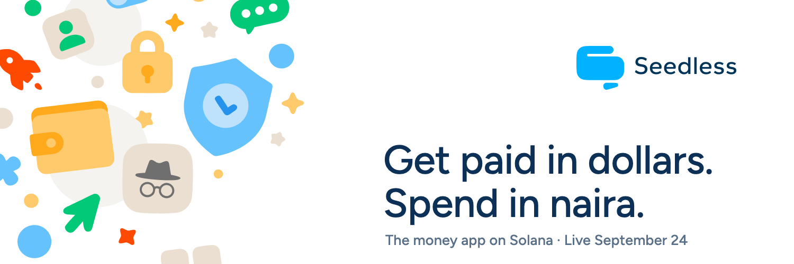
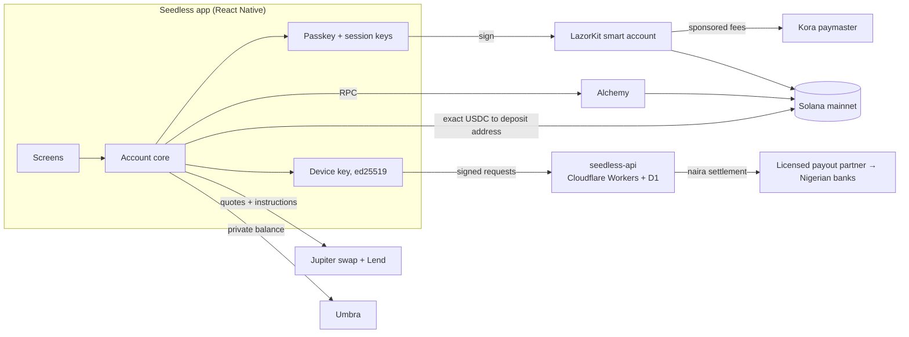

  

# Seedless Labs

**Seedless is a money app for people who get paid in dollars.** Hold dollars and stocks, send money to anyone, and pay any Nigerian bank account straight from the app. It runs on Solana under the hood. There's no seed phrase, and nobody needs to hold SOL for network fees.

This page is the technical reference for how Seedless works. For the product itself, see [seedlesslabs.xyz](https://seedlesslabs.xyz).

| | |
|---|---|
| **Public launch** | 24 September 2026 |
| **Network** | Solana mainnet |
| **Platforms** | Android and the Solana dApp Store at launch, iOS to follow |
| **App** | React Native (Expo), `com.seedless.wallet` |
| **Company** | Seedless Labs, Inc. (Delaware) · Seedless Labs Limited (Nigeria) |

---

## What Seedless does

### Pay a bank account
- **Straight to a Nigerian bank.** Pick a bank, enter an account number, and the account holder's name is returned *before* you confirm. The amount is entered in naira. The app sends the exact USDC the order requires, and a licensed local partner settles the naira.
- **Pay from whatever you hold.** If the account is short of USDC for a payout, Seedless sells just enough of another holding to cover it and shows which asset it used. An account that already holds enough USDC never touches this path.
- **Region-aware.** Bank payouts are live in Nigeria. Everywhere else, the payout screen explains that it isn't available there yet, before anyone fills in bank details.

### Hold and grow
- **Stocks.** Tokenized equities (xStocks) held next to your dollars: Tesla, Apple, NVIDIA, Alphabet, Microsoft, Amazon, Meta, Coinbase, Robinhood, Circle, the S&P 500, the Nasdaq 100 and gold. Each position has **Sell and send to bank**.
- **Earn.** Put USDC into Jupiter Lend and take it out at any time. The rate is variable. The balance you see comes from the chain, and the live ticker is a projection shown separately.

### Send
- **To any Solana address**, with a saved address book and Solana Pay payment requests.
- **Privately**, through Umbra: a private balance and private sends.
- **To someone who doesn't have Seedless.** A claim link carries a one-time key in the URL fragment, which browsers never send to a server. The recipient opens it and the money lands. Unclaimed links can be taken back by the sender.

### Swap
- Any supported pair through Jupiter, and $SEED through Bags.

### The account itself
- **Passkey account** (LazorKit smart account). The authority is a P-256 passkey on the device, confirmed with Face ID or fingerprint.
- **Gasless.** Network fees are sponsored through the Kora paymaster.
- **Session keys.** Short-lived keys authorized for a fixed slot window, so repeated everyday actions don't prompt for biometrics every time.
- **Multiple accounts**, **burner addresses** (isolated keypairs with no on-chain link to the main account), and **stealth addresses**.
- **Curated token list.** Holdings are joined against Jupiter's verified list, so airdropped look-alike tokens don't appear as real balances.
- Transaction history and an optional biometric lock when the app returns from the background.

---

## Architecture

| Layer | Built on |
|---|---|
| Accounts and signing | LazorKit passkey smart accounts (P-256), session keys |
| Fees | Kora paymaster |
| Swaps and yield | Jupiter swap API, Jupiter Lend |
| Stocks | xStocks (SPL Token-2022) |
| Privacy | Umbra SDK |
| RPC | Alchemy |
| Backend | Cloudflare Workers + D1 (`seedless-api`) |
| Payouts | Licensed Nigerian payout partner, called only from the backend |

**How a bank payout moves.** The app never holds a partner credential. It asks `seedless-api` for an order, signed with a device key: a stable ed25519 key, separate from the passkey and from rotating session keys. The API returns a deposit address and an exact USDC amount. The app sends that exact amount on-chain from the user's own account, and the partner settles naira to the bank. The payout partner API key lives only in the Worker.

---

## Fees

One rate, charged on what the user asked for, never on the steps taken to deliver it.

| Action | Fee |
|---|---|
| Pay a Nigerian bank account | 0.5% |
| Swap one token for another | 0.5% |
| Hold, receive, send to any address | Free |
| Selling a holding to cover a payout | Free (already covered by the payout fee) |
| Network fees | Sponsored |

The fee is shown on screen before signing. Swap fees are collected on-chain through Jupiter's platform fee, and only on pairs where USDC is on one side.

---

## Engineering notes

A few problems worth writing down:

- **Token-2022 balances.** Deriving a classic associated token account for an xStock points at an address that can never exist, and the balance silently reads as zero. Holdings are read by token program instead, in one call for the whole portfolio.
- **Stock splits.** xStocks carry a scaled-amount multiplier. Balances use the parsed amount, never `raw / 10^decimals`, so a future split can't misreport a holding.
- **Impostor mints.** A search for `TSLAx` also returns an unrelated pump.fun token with the same symbol. Every stock mint is pinned; nothing is resolved by symbol.
- **Exact payouts from any token.** A bank order needs an exact USDC figure, and Jupiter's exact-output mode has no route for stock pools. A solver seeds from a reverse quote and verifies with exact-input quotes. It works on any Solana token and converges in three to four quotes.
- **Transaction size.** Swaps use direct routes, so the swap plus the passkey authorization stays under Solana's 1,232-byte limit. Larger payloads use LazorKit's authorize-then-execute flow.
- **Fee headroom.** A platform fee comes off the swap output, the same headroom slippage uses. Selling to cover a payout carries no fee, so a payment can’t land a cent short.
- **Sponsored-send limits.** Kora can't enforce spend limits per account, so rate limits on sponsored sends live in the app.

The app has 342 automated tests.

---

## Security

- Keys never leave the device. The account authority is a passkey. Session, burner and device keys live in the platform secure store.
- The payout partner's credentials live only in the backend.
- Payout requests are signed by a device key and verified server-side.
- Stock mints are pinned, and token lists are curated.

**Seedless orchestrates audited infrastructure. Seedless itself has not been audited.**

Responsible disclosure: [seedlesslabs.xyz/security](https://seedlesslabs.xyz/security)

---

## Hackathons

### Won

| Hackathon | Result | Prize | Date |
|---|---|---|---|
| Bags Hackathon | Winner (#5) | $26,000 | May 2026 |
| Colosseum Frontier: Umbra side track | 2nd place | 2,997 USDC | May 2026 |
| Colosseum Frontier: Encrypt / Ika side track | Award | 1,000 USDC | June 2026 |
| Colosseum Frontier: 100xDevs track | 2nd place | 2,000 USDG | July 2026 |

Every prize was announced publicly by the sponsor and paid on-chain.

### Entered

| Hackathon | Organiser | Focus |
|---|---|---|
| Stocklana | Solana Foundation | Stocks held and sold straight to a bank |
| World's Fair | Colosseum | Seedless |
| Monad Metropolis | Monad | Consumer products and payments |
| Clock In | Solana Mobile | Mobile |

---

## Repositories

The app and backend are private. Public here:

| Repository | What it is |
|---|---|
| [`passkey-dwallet-controller`](https://github.com/seedless-labs/passkey-dwallet-controller) | Research: a Pinocchio program that lets a WebAuthn passkey approve Ika dWallet messages. Devnet, not part of the launch app. |
| [`seedless-labs-landing`](https://github.com/seedless-labs/seedless-labs-landing) | The website at seedlesslabs.xyz |

---

  
  <a href="https://seedlesslabs.xyz">seedlesslabs.xyz</a> · <a href="https://x.com/seedless_wallet">@seedless_wallet</a> · founder <a href="https://x.com/francis_codex">@francis_codex</a> · beta <a href="https://t.me/seedless_beta">t.me/seedless_beta</a>

